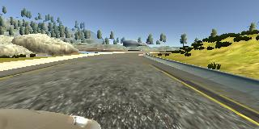
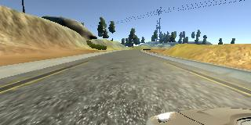

# **Behavioral Cloning** 

## Writeup Template

### You can use this file as a template for your writeup if you want to submit it as a markdown file, but feel free to use some other method and submit a pdf if you prefer.

---

**Behavioral Cloning Project**

The goals / steps of this project are the following:
* Use the simulator to collect data of good driving behavior
* Build, a convolution neural network in Keras that predicts steering angles from images
* Train and validate the model with a training and validation set
* Test that the model successfully drives around track one without leaving the road
* Summarize the results with a written report


[//]: # (Image References)

[image1]: ./examples/placeholder.png "Model Visualization"
[image2]: ./examples/placeholder.png "Grayscaling"
[image3]: ./examples/placeholder_small.png "Recovery Image"
[image4]: ./examples/placeholder_small.png "Recovery Image"
[image5]: ./examples/placeholder_small.png "Recovery Image"
[image6]: ./examples/placeholder_small.png "Normal Image"
[image7]: ./examples/placeholder_small.png "Flipped Image"

## Rubric Points
### Here I will consider the [rubric points](https://review.udacity.com/#!/rubrics/432/view) individually and describe how I addressed each point in my implementation.  

---
### Files Submitted & Code Quality

#### 1. Submission includes all required files and can be used to run the simulator in autonomous mode

My project includes the following files:
* model.py containing the script to create and train the model
* drive.py for driving the car in autonomous mode
* model.h5 containing a trained convolution neural network 
* writeup_report.md or writeup_report.pdf summarizing the results

#### 2. Submission includes functional code
Using the Udacity provided simulator and my drive.py file, the car can be driven autonomously around the track by executing 
```sh
python drive.py model.h5
```

#### 3. Submission code is usable and readable

The model.py file contains the code for training and saving the convolution neural network. The file shows the pipeline I used for training and validating the model, and it contains comments to explain how the code works.

### Model Architecture and Training Strategy

#### 1. An appropriate model architecture has been employed

My model consists of a convolution neural network which is modified from the Nvidia paper [End to End Learning for Self-Driving Cars](https://images.nvidia.com/content/tegra/automotive/images/2016/solutions/pdf/end-to-end-dl-using-px.pdf) (model.py lines 62-80) 

The model includes RELU layers to introduce nonlinearity (code line 62-80), and the data is normalized in the model using a Keras lambda layer (code line 65). 

#### 2. Attempts to reduce overfitting in the model

The model contains dropout layers in order to reduce overfitting (model.py lines 67, 69, 71, 73, 75). 

The model was trained and validated on different data sets to ensure that the model was not overfitting (code line 20, 84). The model was tested by running it through the simulator and ensuring that the vehicle could stay on the track.

#### 3. Model parameter tuning

The model used an adam optimizer, so the learning rate was not tuned manually (model.py line 83).

#### 4. Appropriate training data

Training data was chosen to keep the vehicle driving on the road. I used a combination of center lane driving and I flip the center lane for data augmentation (model.py line 45-46)

For details about how I created the training data, see the next section. 

### Model Architecture and Training Strategy

#### 1. Solution Design Approach

The overall strategy for deriving a model architecture was to use Convolution network and crop the redundant part of the images.

My first step was to use a convolution neural network model similar to the Nvidia paper [End to End Learning for Self-Driving Cars](https://images.nvidia.com/content/tegra/automotive/images/2016/solutions/pdf/end-to-end-dl-using-px.pdf) I thought this model might be appropriate because it shows some stability in the class demo.

In order to gauge how well the model was working, I split my image and steering angle data into a training and validation set. I found that my first model had a low mean squared error on the training set but a high mean squared error on the validation set. This implied that the model was overfitting. 

To combat the overfitting, I modified the model by adding some Dropout layer after convolution layers. I have tried add some Dropout after Dense layer. However the performance is getting worse in my experiments.

Then I also add activation functions for the Dense layers. The paper seems like they do not add activation function for Dense layers (The course video doesn't add activation either). If we don't consider bias, I think that multiple linear layers without activations have the same ability as one linear layer with same projection space. Since they are just matrix if no non linearity provided. Therefore, I add activations for the Dense layers.

The final step was to run the simulator to see how well the car was driving around track one. There were a few spots where the vehicle fell off the track. For example, after the vehicle pass through the bridge. There is a corner with a huge bend. My vehicle failed to stay in the middle and therefore it drive into the water. To improve the driving behavior in these cases, I start to tune the dropout layer's parameter, and as previous discuss I put them only after convolution layers.

At the end of the process, the vehicle is able to drive autonomously around the track without leaving the road.

#### 2. Final Model Architecture

The final model architecture (model.py lines 62-80) is shown as follows using keras model.summary(). 
```
_________________________________________________________________
Layer (type)                 Output Shape              Param #   
=================================================================
cropping2d_1 (Cropping2D)    (None, 90, 320, 3)        0         
_________________________________________________________________
lambda_1 (Lambda)            (None, 90, 320, 3)        0         
_________________________________________________________________
conv2d_1 (Conv2D)            (None, 43, 158, 24)       1824      
_________________________________________________________________
dropout_1 (Dropout)          (None, 43, 158, 24)       0         
_________________________________________________________________
conv2d_2 (Conv2D)            (None, 20, 77, 36)        21636     
_________________________________________________________________
dropout_2 (Dropout)          (None, 20, 77, 36)        0         
_________________________________________________________________
conv2d_3 (Conv2D)            (None, 8, 37, 48)         43248     
_________________________________________________________________
dropout_3 (Dropout)          (None, 8, 37, 48)         0         
_________________________________________________________________
conv2d_4 (Conv2D)            (None, 3, 18, 64)         27712     
_________________________________________________________________
dropout_4 (Dropout)          (None, 3, 18, 64)         0         
_________________________________________________________________
conv2d_5 (Conv2D)            (None, 1, 8, 64)          36928     
_________________________________________________________________
dropout_5 (Dropout)          (None, 1, 8, 64)          0         
_________________________________________________________________
flatten_1 (Flatten)          (None, 512)               0         
_________________________________________________________________
dense_1 (Dense)              (None, 100)               51300     
_________________________________________________________________
dense_2 (Dense)              (None, 50)                5050      
_________________________________________________________________
dense_3 (Dense)              (None, 10)                510       
_________________________________________________________________
dense_4 (Dense)              (None, 1)                 11        
=================================================================
Total params: 188,219
Trainable params: 188,219
Non-trainable params: 0
_________________________________________________________________
```

#### 3. Creation of the Training Set & Training Process

To capture good driving behavior, I use the sample data provided in the porject. Here is an example image of center lane driving:




To augment the data sat, I also flipped images and angles thinking that this would help data learn how to recover from different angels. For example, here is an image that has then been flipped:


After the collection process, I had 24108 number of data points. I then preprocessed this data by Cropping the top 50 pixels and bottom 20 pixels. Then, normalize the images by dividing 127.5 and minus 1.


I finally randomly shuffled the data set and put 20% of the data into a validation set. 

I used this training data for training the model. The validation set helped determine if the model was over or under fitting. The ideal number of epochs was 10 as evidenced by the training error and validation error coverges around epoch 8. I used an adam optimizer so that manually training the learning rate wasn't necessary.
