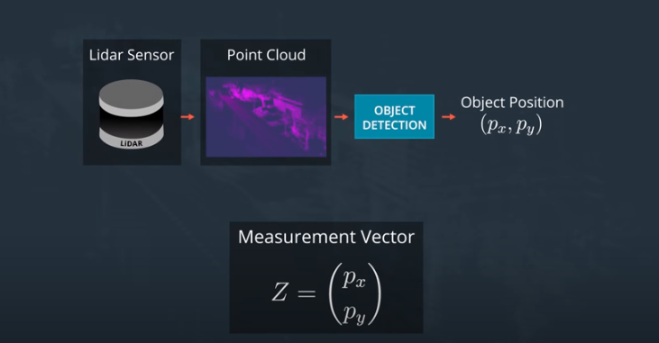
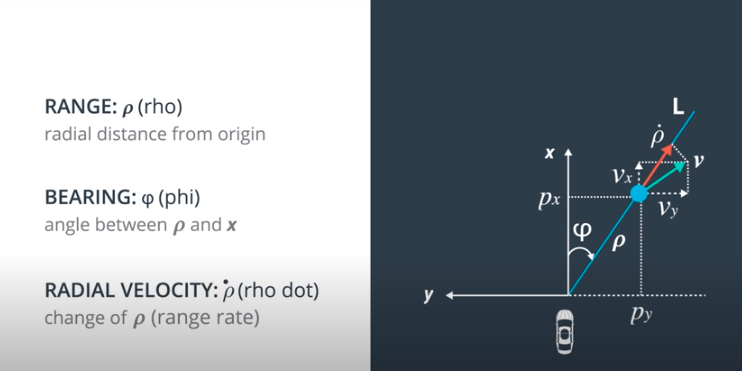
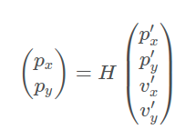
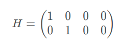
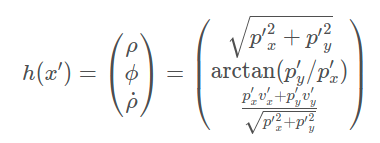
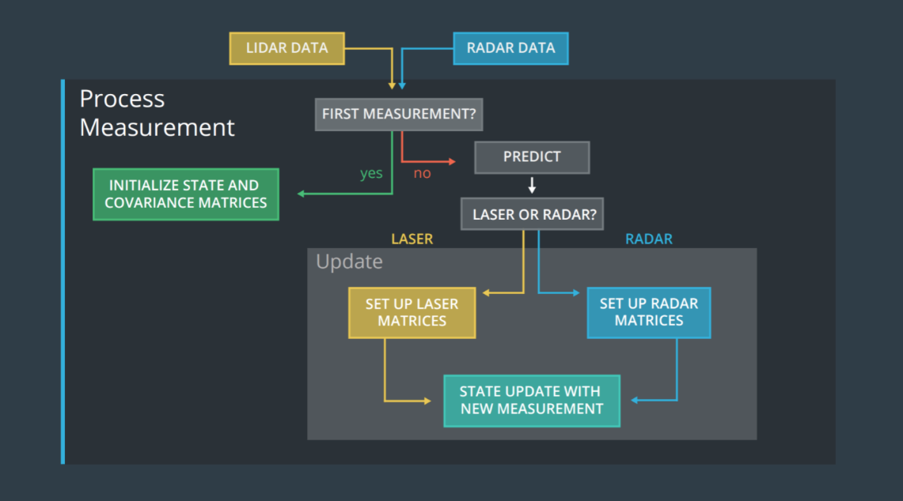
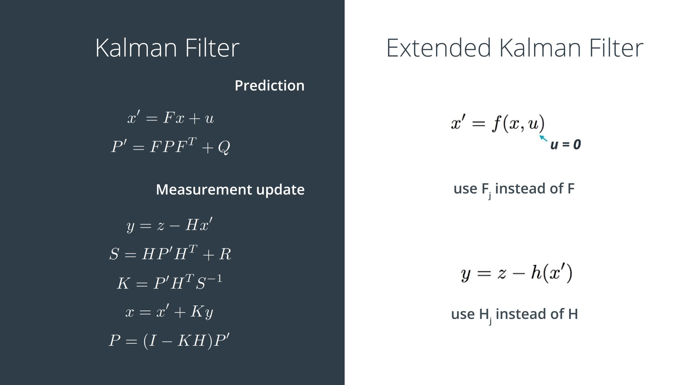
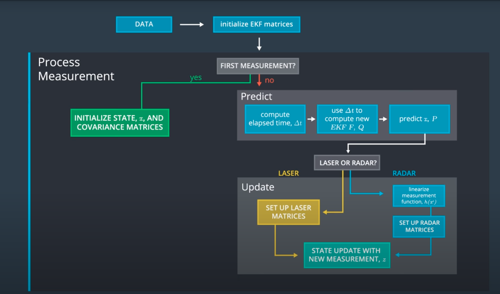

# **Extended Kalman Filter** 
### Sensor type
Lidar data provides: position  
	  
Radar data provides: range, bearing and raidal velocity  

### State
The state for Kalman Filter is [px, py, vx, vy].  
The transformation of lidar data to state is linear.   

  
However, the transformation of radar data to state is non linear. Therefore, we need to use Extended Kalman Filter.  
  
The Extended Kalman Filter uses a method called first order Taylor expansion. Details are shown in [sensor-fusion-ekf-reference](sensor-fusion-ekf-reference.pdf)

### Overview image

### Extended Kalman Filter algorithm

### General flow 

### Result (gif)
Lidar measurements are red circles, radar measurements are blue circles with an arrow pointing in the direction of the observed angle, and estimation markers are green triangles.
