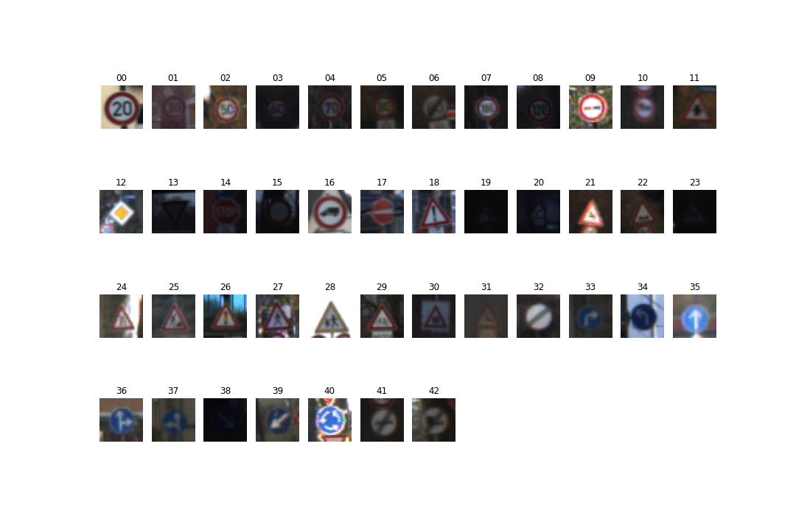
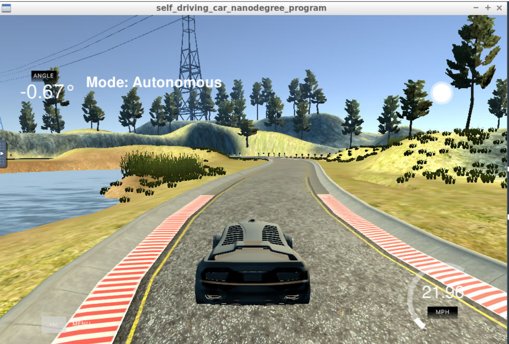
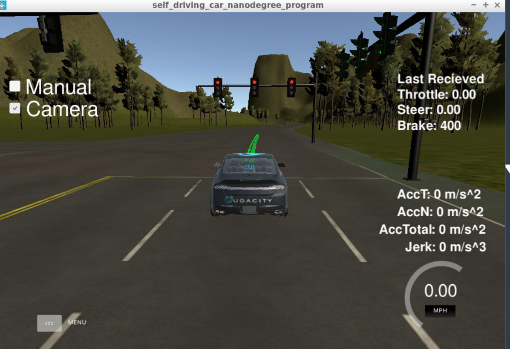

# Self-Driving-Car-Engineer-Nanodegree-Program
This is the project of Udacity Self-Driving-Car-Engineer-Nanodegree-Program

# Projects
<table style="width:100%">
  <tr>
    <th>
      

           
            Project1: Finding Lane Lines on the Road 
         <a href="./Project1-Finding-Lane-Lines-on-the-Road/P1.ipynb" name="p1_code">(code notebook)</a>
         <a href="./Project1-Finding-Lane-Lines-on-the-Road/writeup_template.md" name="p1_writeup">(writeup)</a>
      

    </th>
        <th>

           
            Project2: CarND Advanced Lane Lines
            <a href="./Project2-CarND-Advanced-Lane-Lines/main.ipynb" name="p2_code">(code notebook)</a>
           <a href="./Project2-CarND-Advanced-Lane-Lines/writeup.md" name="p2_writeup">(writeup)</a>
        

    </th>
       <th>

           
            Project3: Traffic Sign Classifier
            <a href="./Project3-Traffic-Sign-Classifier/Traffic_Sign_Classifier.ipynb" name="p3_code">(code notebook)</a>
            <a href="./Project3-Traffic-Sign-Classifier/writeup_template.md" name="p3_wirteup">(writeup)</a>
        

    </th>
  </tr>
  <tr>
        <th>

           
            Project4: Behavioral Cloning
            <a href="./Project4-Behavioral-Cloning/model.py" name="p4_code">(training code)</a>
            <a href="./Project4-Behavioral-Cloning/writeup_template.md" name="p4_writeup">(writeup)</a>
        

    </th>
    <th>

           
            Project5: Extended Kalman Filter
            <a href="./Project5-Extended-Kalman-Filter-Project/src" name="p5_code">(code src)</a>
            <a href="./Project5-Extended-Kalman-Filter-Project/writeup.md" name="p5_writeup">(writeup)</a>
        

    </th>
        <th>

           
            Project6: Kidnapped Vehicle
            <a href="./Project6-Kidnapped-Vehicle-Project/src" name="p6_code">(code src)</a>
            <a href="./Project6-Kidnapped-Vehicle-Project/writeup.md" name="p6_writeup">(writeup)</a>
        

    </th>
  </tr>
  <tr>
    <th>

           
            Project7: Highway Driving
            <a href="./Project7-Highway-Driving/src" name="p7_code">(code src)</a>
            <a href="./Project7-Highway-Driving/writeup.md" name="p7_writeup">(writeup)</a>
        

    </th>
    <th>

           
            Project8: PID Control
            <a href="./Project8-PID-Control-Project/src" name="p8_code">(code src)</a>
            <a href="./Project8-PID-Control-Project/writeup.md" name="p8_writeup">(writeup)</a>
        

    </th>
    <th>

           
            Project9: System Integration
            <a href="./Project9-System-Integration/ros/src" name="p9_code">(code src)</a>
            <a href="./Project9-System-Integration/writeup.md" name="p9_writeup">(writeup)</a>
        

    </th>
 </tr>
 <tr>
</table>

